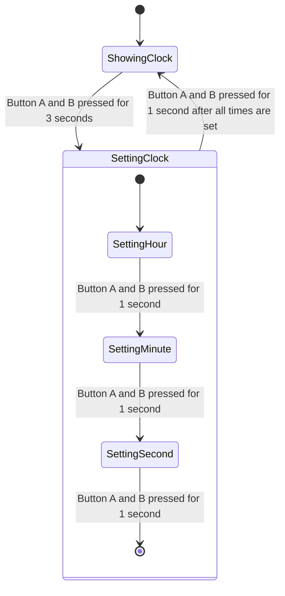

# Clock

## States

```mermaid
stateDiagram-v2
    [*] --> ShowingClock
    ShowingClock --> SettingClock : Button A and B pressed for 3 seconds
    SettingClock --> ShowingClock : Button A and B pressed for 1 second after all times are set

    state SettingClock {
        [*] --> SettingHour
        SettingHour --> SettingMinute : Button A and B pressed for 1 second
        SettingMinute --> SettingSecond : Button A and B pressed for 1 second
        SettingSecond --> [*] : Button A and B pressed for 1 second
    }
```
