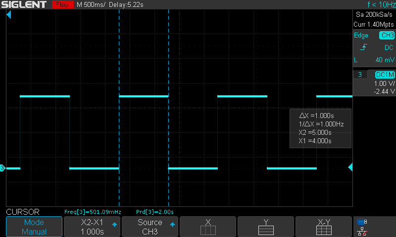

# Delay verification

By using the code from commit [`4eecf6717d371d5c2a3ff043f9b81a488052e027`](https://github.com/enzoevers/LedMatrixDriver/tree/4eecf6717d371d5c2a3ff043f9b81a488052e027) it was verified that the delay can generate an accurate 1 second delay.



The following code was used:


`SetupHardwareStm32f303xc.cpp`
```C++
#include "SetupHardwareStm32f303xc.h"

#include "BitManipulation.h"
#include "defines.h"

static auto SetupClock() -> void;
static auto SetupGpio() -> void;
static auto SetupTimers() -> void;

//====================
// HardwareSetup.h
//====================

auto HardwareSetup() -> void {
    SetupClock();
    SetupGpio();
    SetupTimers();
}

//====================
// Local
//====================

static auto SetupClock() -> void {
    __IO uint32_t tmpreg;

    //----------
    // GPIO clocks
    //----------
    SET_BIT(RCC->AHBENR, RCC_AHBENR_GPIOEEN); /* Delay after an RCC peripheral clock enabling */
    tmpreg = READ_BIT(RCC->AHBENR, RCC_AHBENR_GPIOEEN);
    UNUSED(tmpreg);

    //----------
    // Timer clocks
    //----------

    // APB1 - HCLK not divided
    RCC->CFGR &= ~RCC_CFGR_PPRE1_2;

    // HLCK - SYSCLK not divided
    RCC->CFGR &= ~RCC_CFGR_HPRE_3;

    // Select HSI for SYSCLOCK
    RCC->CFGR &= ~RCC_CFGR_SW_0;
    RCC->CFGR &= ~RCC_CFGR_SW_1;

    // Enable HSI clock
    RCC->CR |= RCC_CR_HSION;

    while (!(RCC->CR & RCC_CR_HSIRDY)) {
        // Wait till HSI is ready
    }
}

#define CONFIG_OUTPUT(PORT, PIN)                                                  \
    {                                                                             \
        /* Output */                                                              \
        SET_BIT(GPIO##PORT->MODER, 0b1 << GPIO_MODER_MODER##PIN##_Pos);           \
        CLEAR_BIT(GPIO##PORT->MODER, 0b1 << (1 + GPIO_MODER_MODER##PIN##_Pos));   \
                                                                                  \
        /* Push-Pull */                                                           \
        CLEAR_BIT(GPIO##PORT->OTYPER, GPIO_OTYPER_OT_##PIN);                      \
                                                                                  \
        /* Low speed */                                                           \
        CLEAR_BIT(GPIO##PORT->OSPEEDR, 0b11 << GPIO_OSPEEDER_OSPEEDR##PIN##_Pos); \
                                                                                  \
        /* No pull-up, pull-down */                                               \
        CLEAR_BIT(GPIO##PORT->PUPDR, 0b11 << GPIO_PUPDR_PUPDR##PIN##_Pos);        \
    }

static auto SetupGpio() -> void {
    CONFIG_OUTPUT(E, 13)
}

static auto SetupTimers() -> void {
    //----------
    // TIM3
    //----------

    // Disable slave mode
    TIM3->SMCR &= ~TIM_SMCR_SMS_0;
    TIM3->SMCR &= ~TIM_SMCR_SMS_1;
    TIM3->SMCR &= ~TIM_SMCR_SMS_2;
    TIM3->SMCR &= ~TIM_SMCR_SMS_3;

    // Set as edge-aligned upcounter
    TIM3->CR1 &= ~TIM_CR1_CMS_0;
    TIM3->CR1 &= ~TIM_CR1_CMS_1;
    TIM3->CR1 &= ~TIM_CR1_DIR;

    RCC->APB1ENR |= RCC_APB1ENR_TIM3EN;
}
```

`main.cpp`
```C++
#include "BitManipulation.h"
#include "defines.h"  // Generate by cmake based on defines.h.in

#if defined(USE_STM32F303XC)
#include "SetupHardwareStm32f303xc.h"
#endif

#if defined(USE_STM32)
#include "DelayStm32.h"
#include "GPIOOutputStm32.h"
#endif

int main() {
    HardwareSetup();

#if defined(USE_STM32)
    auto led = GPIOOutputStm32();
    led.SetupConfiguration({&GPIOE->ODR, GPIO_ODR_13});
    
    uint32_t tim3Hertz = 8000000;
    auto delayTim3 = DelayStm32();
    delayTim3.SetupConfiguration({&TIM3->SR, &TIM3->ARR, &TIM3->CR1, &TIM3->PSC, tim3Hertz, TIM_SR_UIF, TIM_CR1_CEN});
#endif

    while (true) {
        led.SetState(true);
        delayTim3.SynchronousWait_us(1000000);
        led.SetState(false);
        delayTim3.SynchronousWait_us(1000000);
    }

    return 0;
}
```