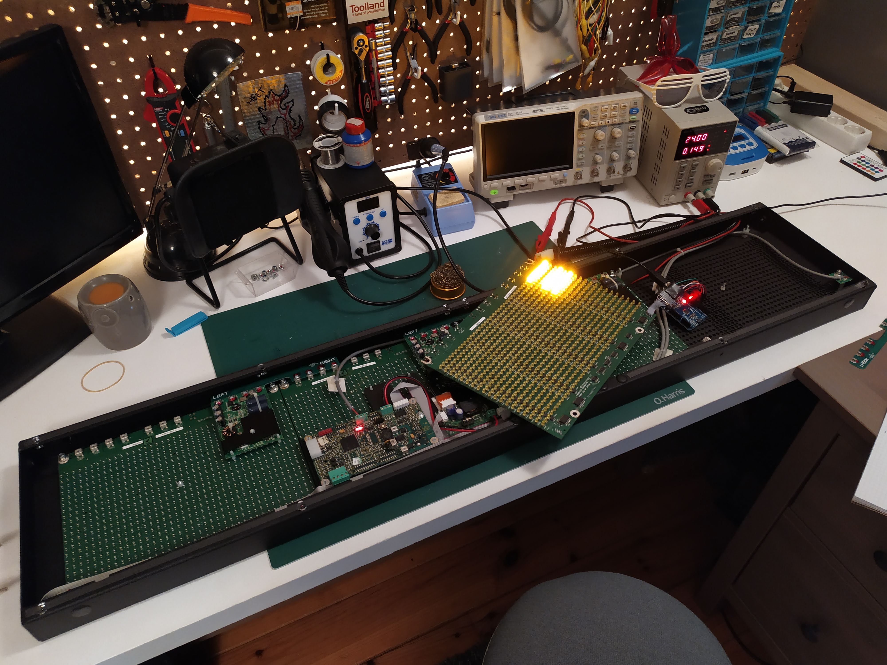
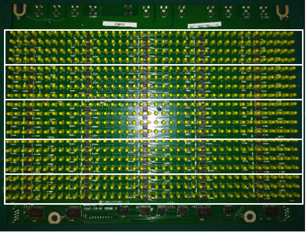
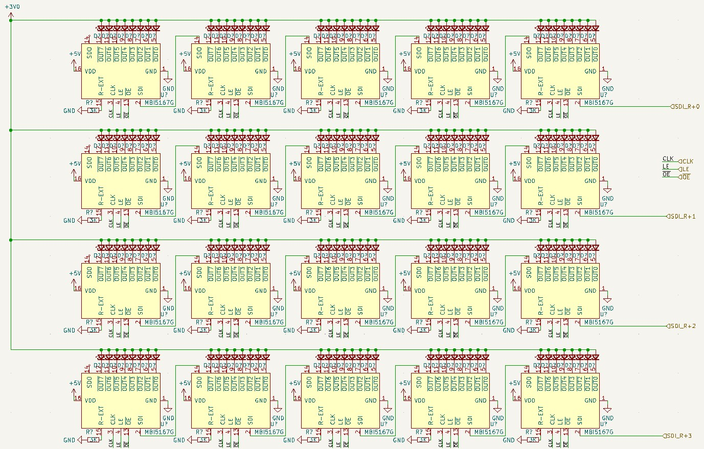
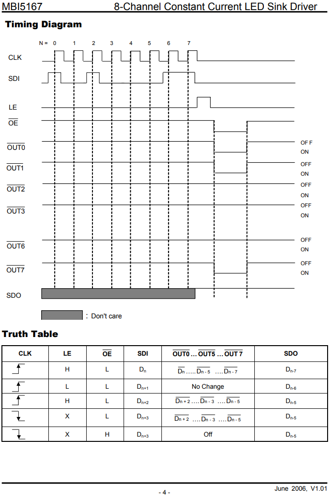
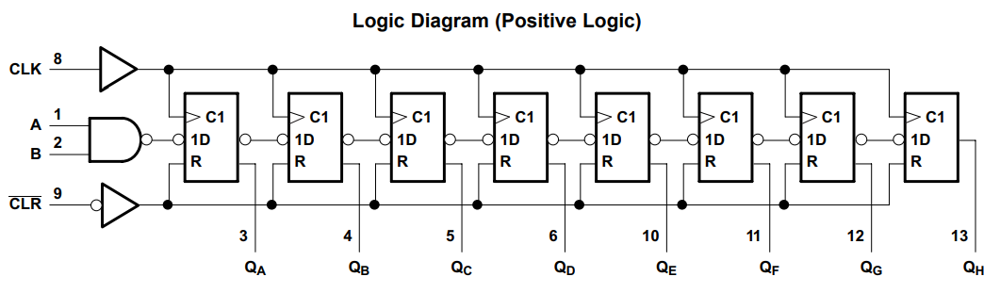
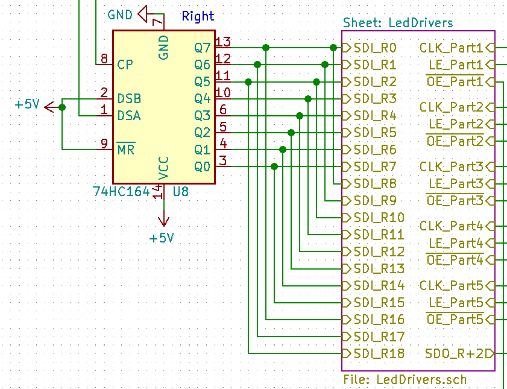
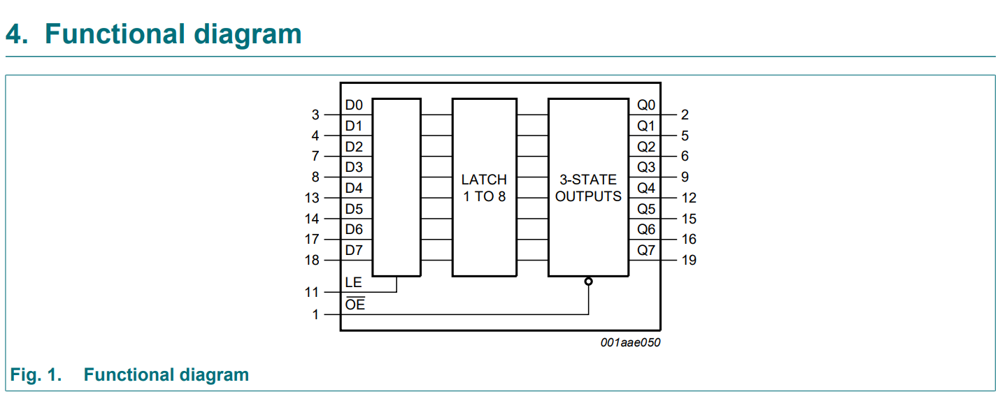
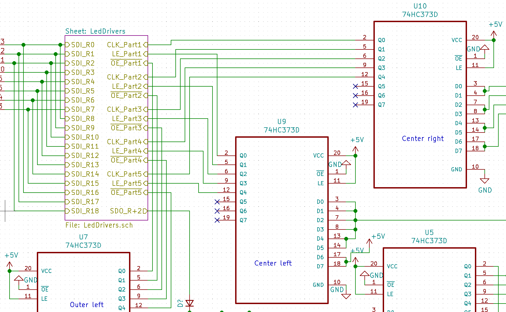
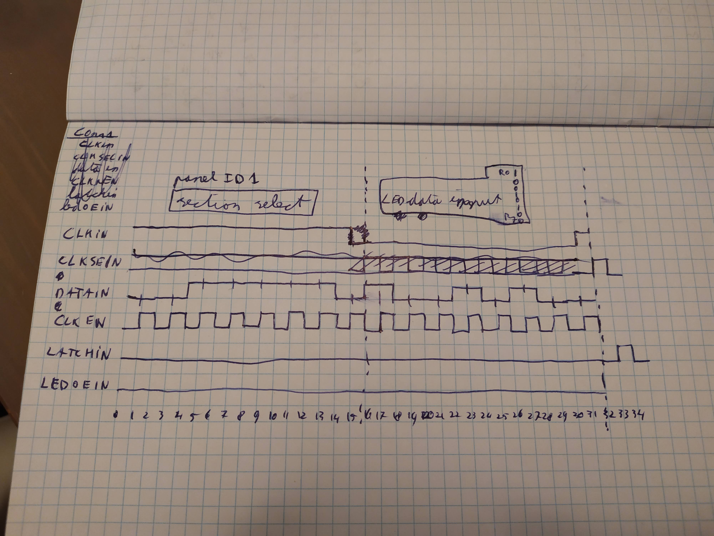

# Purpose
This document will analyse the signal flow of a single LED matrix panel. This is done by starting at the LEDs and going backwards until the input header is reached.

## Basic description of the hardware

The LED matrix consists of four panels, each with 40x19 LEDs linked together.

Each panel consist of 5 sections that are stacked on top of eachother (later more on this).

## Direct LED control
The LEDs are driven by the the [MBI5167G](./Datasheet/MBI5167/MBI5167_Datasheet.pdf) 8-channel LED driver chip.

The cathode (negative) of the LEDs are connected to the ~OUTn pins of the MBI5167G. A single MBI5167G has 8 ~OUTn pins. Each row has 40 LEDs, meaning that each row needs 5 MBI5167G ICs. The **~OUTn pins are active-low**. This means that when the shift register of the MBI5167G is completely filled with 1's (through the SDI pin), All outputs are 0 (since the output is only active if it's corresponding bit in the shift register is filled with a 0) and the LEDs will turn on due to the negative of the led now being connected to 0v.

In the image above you can see the small IC's in between the LEDs. These are the MBI5167G ICs. 

The connections for a single section (one of the white boxes from above) are as shown in the schematic below. Looking from the same perspective as in the image above. Note that the control signals (CLK, LE, ~OE) are connected together while each row has a seperate data input input line. This means on each clock pulse of a section, we write four pixels (in one column).

## Data input
The MBI5167G acts as an 8-bit shift register with SDI (data input) and SDO (data out). Data on the **SDI is clocked in at the rising-clock**.

The latch pin (LE) is used to separate the input from the output. The **shifted data is shown on the output when when LE is pulsed high**

The inverted output enable (~OE) pin is used to set all ~OUTn pins to 1 or 0. When **~OE is low the latched data is shown (meaning the output is enabled)**.

# MBI5167G connections to other ICs
The folliwng ICs are connected to the MBI5167Gs
- 74HC164 (the right one on the panel): Provides data on the SDI pins.
- 74HC373: Three of these are connected.
    - Outer left: Controls the ~OE pins.
    - Center left: Controls the LE pins.
    - Center right: Controls the CLK pins.

## 74HC164

The 74HC164 is a shift register. On the panel both input B (pin 2) and ~CLR (pin 9) are connected to 5V. This means that **only input A (pin 1) takes data input**.

The outputs of the 74HC164 are connected the most right MBI5167G IC of each row. It is important to see that **a single output of the shift register is connected to multiple rows**.

## 74HC373

As shown previously, there are sections of 4 rows (and one with 3 rows). Each section shares the CLK/LE/~OE signals and are controlled by the outputs of three 74HC373 ICs. These **sections are used to control which rows take the current values of the 74HC164**.

Since ~OE is pulled low and LE is pulled HIGH the **data between Dn and Qn is transparant**.

### MBI5167G control input signals
For simplicity the clock and data for the right 74HC164 IC is ignored. It is assumed that the clock of the shift register is setup so that the correct data is shifted in the MBI5167G on the clock for a certain section. More detail about this will be discussed later on.

The right 74HC164 output 8 bits and this covers 8 rows. This is equivalent to 2 sections (of 4 rows). To **not** shift data into the MBI5167G the CLK pin should be kept low.

**Once the first eight rows of the first column are fed with data the next two sections are clocked in** and after that the last section (with 3 rows) is clocked in.

There is the option to either to it column-by-columns, or to shift a complete row of data into the row and only then go to the next sections.

The **latch signal should be pulsed after every column**. Otherwise no new data will be presented to the output of the MBI5167Gs. While all latch signals are tied together (see the input of the 'Center left' 74HC373), not all clocks are and thus not all all MBI5167G ICs get new data clocked in. Which is good. 

The **~OE signals have a fixed time difference between them**. When the ~OE signal of section 1 and 2 is pulled down, section 3 and 4 are pulled down 1us later and section 5 is pulled down 1us after that. It is of course possible to keep the ~OE signals for section 1 and 2 pulled down to have pull all other ~OE signals down.

# LED data and clock shift register
There are two 74HC164 shift registers on a panel. The input port of both are connected with each other. The left 74HC164 is used for driving the clock signals of the MBI5167G sections. The right one is used for the LED data.

The reason that a shared data input line works is because the clock for both 74HC164 shift registers is driven by the right 74HC138 (8-bit) demultiplexer. Of this 74HC138 the B and C inputs are pulled low while the A input is controlled by the input connector (pin 2 of Conn1). By toggling input A the outputs Y0 and Y1 are pulsing inverted relative to each other. Y0 is connected to the clock of the right 74HC164 (LED data) while Y1 is connected to the clock of the left 74HC164 (section clock). **The data on the data input line should this allign with the rising clock of the shift register in which the data should end up**.

If input A at the right 74HC138 is kept at a certain value then the corresponding output can also be toggled by using the active-low enable input which is connected to pin 5 on Conn1. The same goes for the active-low enable input of the left 74HC138 which is connected to pin 2 on Conn1.

On the output of the left 74HC164 (section clock) is also a header connected on which a jumper connects a certain output with a pull-up resistor. One of the active low enable pins on the left 74HC138 demultiplexer (which selects which section is clocked) is also connected to this pull-up resistor. when the jumper is set to, for example connect Q0 of the left 74HC164 with the pull-up resistor, then the left 74HC138 will only be enabled when there is a 0 on Q0. 

The jumper is used to disable or enable the clock of a certain panel when data is send for another panel.

# Signal flow on Conn1

## Section and panel select
Pin 5 is a constant clock. Pin 2 determines wheter the left or right 74HC164 is clocked. When pin 2 is high the left 74HC164 is being clocked. 

In this state the data on pin 4 should send 8 bits of data. The first 2 bits being send are used to select the current sections. Since two sections are clocked together there are three clock sections. The first two bits being send are thus binary 0-2.

| Data | Description | Options |
|:---: | :--- | :--- |
| [7:6] | Binary sections select | 00: sections 1-2 01: sections 3-4 10: section 5 |
| [5:0] | Panel select. Active-low | 111110: Panel 1 111101: Panel 2 111011: Panel 3 110111: Panel 4 101111: Panel 5 011111: Panel 6  |

When sending the data, a single bit should be held for one clock cycle starting at the falling edge of the clock. This ensures that at the next rising clock the signal on the data line is stable.

After this data is shifted into the left 74HC164 the signal on pin 1 can be pulled low to start clocking the right 74HC164. Pulling pin 1 down can be done at the rising clock edge of for the last data bit. Pulling pin 1 down will result in a high-pulled clock for the left 74HC164 which is what the clock was already doing anyway. The duration of this last data bit should still be a complete clock cycle however just like the others.

## Data input
When all bits for the section and panel select are shifted in the data can be send. On the falling clock edge after the last data bit the data for the rows can be clocked in. For the row data the first data being send corresponds to the first row. Sending 10010100 this results in the first led of row 0 to be on, the first leds of row 1 and 2 of, on for row 3 and 5 and off for row 4, 6 and 7. 

During this time the signal on pin 3 (left 74HC138 active-low enable) and 6 (Latch enable for the MBI5167Gs) should be kept low.

When all the data is clocked in pin 3 should be pulsed once. When the active-low enable pin of the 74HC138 is high the demultiplexer is disabled, resulting in all 1's on the output. Enabling the demultiplexer again sets the selected output to low again. This creates the clock pulse the for MBI5167Gs in the selected sections. Only one clock pulse is needed since each row only has a single new data bit. The data of the MBI5167G as a result of this clock pulse also shift by one (to the left on the panel). Now that the data is clocked in it still needs to be latched. This is done by pulsing the signal on pin 6 once.

       
The HC14 smitch triggers are possibly used to create a delay. That would explain the different resistor values. T = R * C
R6 = 2700 ohm
R7 = 1300 ohm

Outer left 74HC373
Delta D0(/1) - D2(/3) = 1us falling, 1.26us rising 
Delta D0(/1) - D4(/5) = 2.06us falling, 2.68us rising