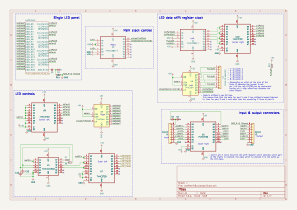

# Purpose
This document will analyse the signal flow of a single LED matrix panel. This is done by starting at the LEDs and going 'upwards' until the input header is reached.

## Basic description of the hardware

The LED matrix consists of 4 panels, each with 40x19 LEDs linked together. In the picture below you see one of the panels taken out.

  

Each panel consist of 5 sections that are stacked on top of each other (later more on this). The top 4 sections are 4 LEDs in height and the last section is 3 LEDs in height. This can also be seen in the image below.

The ICs seen on a single panel are described in the schematic below.

The block in the schematic with the text "Single LED panel" look on the inside like this:

Each block represents one outlined section on the panel. Each section looks as follows:

The only different for the last section is that it has 3 rows instead of 4.

## Direct LED control
The LEDs are driven by the the [MBI5167G](./Datasheet/MBI5167_Datasheet.pdf) 8-channel (shift register) LED driver chip. In the image above you can see the small IC's in between the LEDs. These are the MBI5167G ICs. 

The cathode (negative) of the LEDs are connected to the ~OUTn pins of the MBI5167G. A single MBI5167G has 8 ~OUTn pins. Each row has 40 LEDs, meaning that each row needs 5 MBI5167G ICs. The **~OUTn pins are active-low**. This means that when the shift register of the MBI5167G is completely filled with 1's (through the SDI pin), All outputs are 0 and the LEDs will turn on due to the negative of the LED now being connected to 0v.

The connections for a single section (one of the white boxes from above) are as shown in the schematic above. Note that the signals come in from the right of the panel (looking from the same perspective as in the image above). Note that the control signals (CLK, LE, ~OE) of all ICs in one section are connected together while each row has a separate data input line. **This means that on each clock pulse of a panel we write four pixels (in one column)**.

Another thing to note in the schematics is that the clock signals are controlled in pairs. Meaning that section 1 and 2 are clocked together, sections 3 and 4 are clocked together, and section 5 is clocked separately. This makes sense when you think about it. One of the 74HC164 ICs (in the "LED controls" box) provides 8 shifted-in data bits. This allows providing a pixel to each row in a single clock cycle.

## Clock and data structure
The blocks "Main clock control" and "LED data shift register clock" needs some more attention. The signals in these blocks control:
- Whether LED data is clocked in or if panel/section select data is clocked in.
- What panel is selected
- What section of a panel is selected
- Clocking in LED or panel/section select data

Three pins of the input connector are needed for the clock:
- Pin 2: clkIn
- Pin 3: clkSelEn
- Pin 5: clkEn

The remainig pins are used get data in and show it:
- Pin 4: dataIn
- Pin 6: latchIn
- pin 7: ledOeIn

The signals names of the pins are maybe a bit counterintuitive. The pin that acts as the clock-like signal is the ClkEn pin. This name for the signal is chosen since it relates to the function of the pin on the 74HC138D in the "Main clock control" block to which it is connected. It is connected to pin 4 which is ~E1. When this pin is HIGH, all outputs are HIGH. In this pin is LOW, the output depends on the clkIn signal that is connected to pin 1 on the 74HC138D.

The clkSelEn signal is connected to the 74HC138D in the "LED data shift register clock" block to pin 5 (~E2) and is used in a similar way as clkEn. Mainly being the the actual clock while the inputs A0 and A1 are used to select which outputs are clocked.

Selecting how the data is interpretated is show in the image below. Also note that the clkSelEn signals acts as the clock for the MBI5167G shift registers of the LEDs 

## Section and panel select
On the output of the left 74HC164 (section clock) in the "LED data shift register clock" block is also a header connected on which a jumper connects a certain output with a pull-up resistor. One of the active low enable pins on the left 74HC138 demultiplexer (which selects which section is clocked) is also connected to this pull-up resistor. when the jumper is set to, for example connect Q0 of the left 74HC164 with the pull-up resistor, then the left 74HC138 will only be enabled when there is a 0 on Q0. 

The jumper is used to disable or enable the clock of a certain panel when data is send for another panel.

When clocking in the panel and section select data, the first 2 bits being sent (which end up being bits 6 and 7 due to the shift register) are used to select the current sections. The remaining bits are used to select the panel. The output of these remaining bits connect the pull up resistor either to Vcc or to GND. As stated earlier, how this pull up resistor is connected determines wheter or not a panel is selected.

Note that in the table below the the bit order in the "Data" column corresponds to the order of the buts in the "Options" column.

| Data | Description | Options |
|:---: | :--- | :--- |
| [6:7] | Binary sections select | 00: sections 1 & 2 01: sections 3 & 4 10: section 5 |
| [5:0] | Panel select. Active-low | 111110: Panel 1 111101: Panel 2 111011: Panel 3 110111: Panel 4 |

<!--
The **~OE signals of the MBI5167G ICs have a fixed time difference between them**. When the ~OE signals of section 1 and 2 (the top 8 rows) are pulled down, section 3 and 4 are pulled down 1us later and section 5 is pulled down 1us after that.

The HC14 smitch triggers are possibly used to create a delay. That would explain the different resistor values. T = R * C
R6 = 2700 ohm
R7 = 1300 ohm

Outer left 74HC373
Delta D0(/1) - D2(/3) = 1us falling, 1.26us rising 
Delta D0(/1) - D4(/5) = 2.06us falling, 2.68us rising
-->
